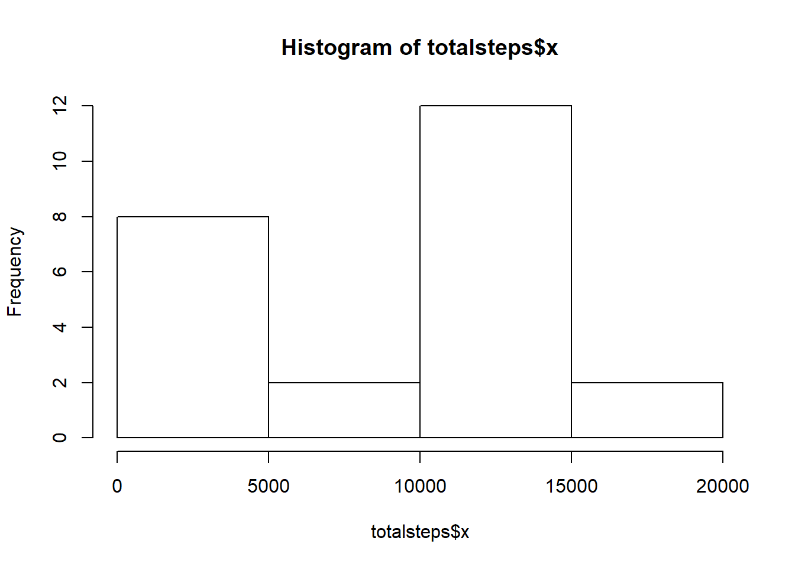
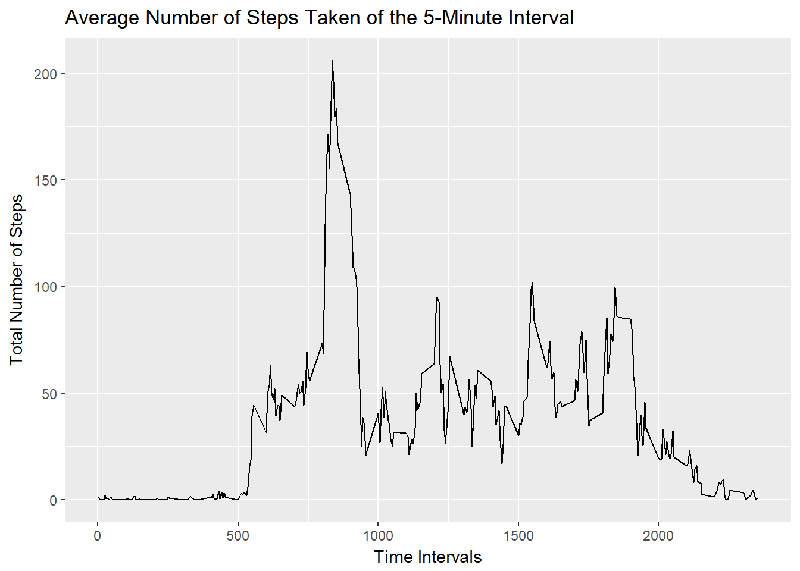
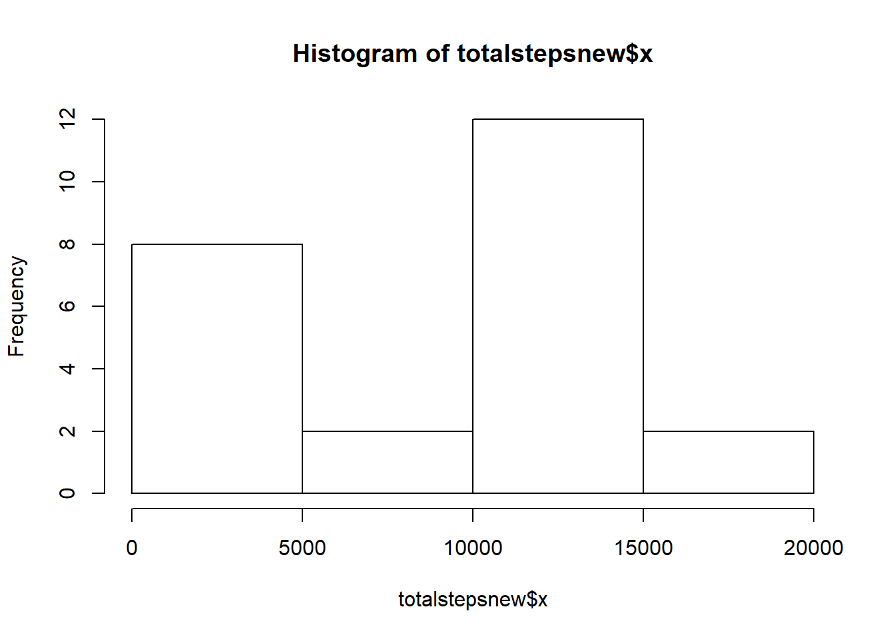
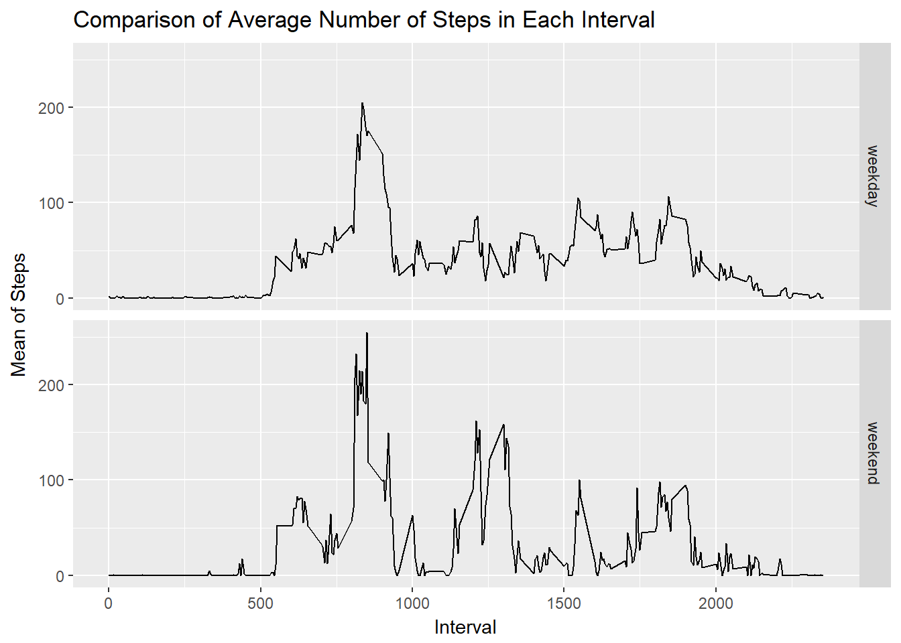

Data
----

This data measures activity at 5 minute intervals. It was collected from
a personal activity device between October and November of 2012. First,
we need to read in the data.

    activity <- read.csv("activity.csv", header = TRUE)
    activity$date <- as.Date(activity$date)

Results
-------

### What is the total number of steps taken each day?

Let's calculate the total number of steps, removing the values that are
NA

    totalsteps <- aggregate(activity$steps, by=list(Category=activity$date), FUN=sum, na.rm = TRUE)

    hist(totalsteps$x)

    mean(totalsteps$x)

    ## [1] 8047.458

    median(totalsteps$x)

    ## [1] 10505

You can see from the histogram that the data is not normally
distributed. Also, the mean and median are not equal and they would be
if the data were normally distributed.

### What is the average daily activity pattern?

We will now create a time series graph of the data.

    activity_no_na <- aggregate(steps ~ interval, data = activity, FUN =mean)
    library(ggplot2)
    TimeSeries1 <- ggplot(data = activity_no_na, aes(x = interval, y = steps)) + 
        geom_line() +
        xlab("Time Intervals") + 
        ylab("Total Number of Steps") +
        ggtitle("Average Number of Steps Taken of the 5-Minute Interval")
    print(TimeSeries1)

    activity_no_na[which(activity_no_na$steps == max(activity_no_na$steps)),]

    ##     interval    steps
    ## 104      835 206.1698

Above we have shown which 5 minute interval contained the maximum number
of steps.

### Imputing missing values

We need to find the total number of rows with missing values and replace
them with the mean value for that day. Then, we will re-plot a histogram
of the total steps taken each day and re-calculate the mean and median.

    sum(is.na(activity$steps),is.na(activity$date),is.na(activity$interval))

    ## [1] 12960

    library(dplyr)

    ## 
    ## Attaching package: 'dplyr'

    ## The following objects are masked from 'package:stats':
    ## 
    ##     filter, lag

    ## The following objects are masked from 'package:base':
    ## 
    ##     intersect, setdiff, setequal, union

    newactivity <- transform(activity, 
              steps = ifelse(is.na(steps), 
                              ave(steps, date, FUN = function(x) mean(x, na.rm = TRUE)), 
                              steps))
    totalstepsnew <- aggregate(newactivity$steps, by=list(Category=newactivity$date), FUN=sum, na.rm = TRUE)
    hist(totalstepsnew$x)

    mean(totalstepsnew$x)

    ## [1] 8047.458

    median(totalstepsnew$x)

    ## [1] 10505

The mean and median above are unchanged.

### Difference between weekdays and weekends

Next, we plot the difference between weekdays and weekends.

    library(ggplot2)
    newactivity$Weektype <- ifelse(weekdays(activity$date) %in% c("Saturday", "Sunday"), "weekend", "weekday")
    grp_cols <- names(newactivity)[c(3,4)]
    dots <- lapply(grp_cols, as.symbol)
    newactivity <- (newactivity %>% group_by_(.dots = dots) %>% summarise(Mean = mean(steps, na.rm=TRUE)))
    ggplot(newactivity, mapping = aes(x = interval, y = Mean)) + geom_line() +
      facet_grid(Weektype ~.) + xlab("Interval") + ylab("Mean of Steps") +
      ggtitle("Comparison of Average Number of Steps in Each Interval")

